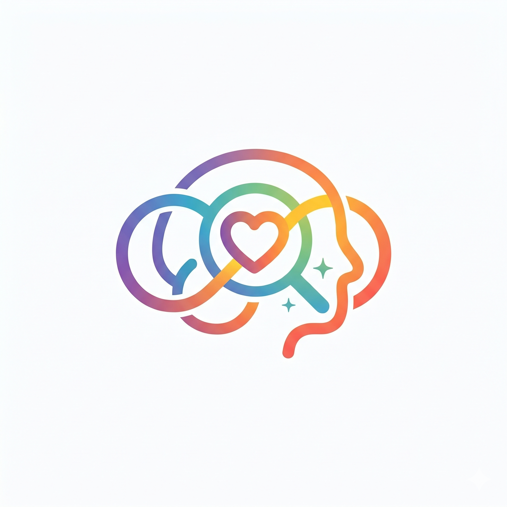

<p align="center">
  
</p>

<h1 align="center">MannSaathi — AutiSense AI</h1>

<p align="center">
  <strong>AI-powered autism spectrum disorder screening platform</strong><br/>
  Real-time behavioral analysis &nbsp;·&nbsp; ML risk prediction &nbsp;·&nbsp; Clinical-grade reports
</p>

<p align="center">
  <a href="https://github.com/amank9115/AutiSense-AI/actions/workflows/ci.yml">
    
  </a>
  
  
  
  
  
</p>

---

## What it does

MannSaathi helps parents and clinicians identify early ASD indicators in children through a structured camera-based screening session. The platform:

- Records a short webcam session and extracts gaze, attention, emotion, and gesture signals frame-by-frame
- Runs the signal vectors through a trained scikit-learn model to produce a risk score and AQ-10 breakdown
- Generates a downloadable PDF clinical report that parents can share directly with a linked doctor
- Provides a doctor dashboard for reviewing shared reports, adding clinical notes, and tracking patients over time

> **Disclaimer:** This is a screening aid, not a medical diagnosis tool. Always involve a licensed clinician for formal evaluation.

---

## Architecture

```
┌──────────────────┐     ┌──────────────────┐     ┌──────────────────┐
│   Next.js 15     │────▶│   NestJS 11 API  │────▶│  FastAPI + ML    │
│   (frontend/)    │     │   (backend/)     │     │  (ml-service/)   │
│                  │     │                  │     │                  │
│ • Camera UI      │     │ • JWT + refresh  │     │ • MediaPipe CV   │
│ • Parent dash    │     │ • RBAC (roles)   │     │ • scikit-learn   │
│ • Doctor dash    │     │ • Prisma ORM     │     │ • PDF reports    │
│ • AI assistant   │     │ • Redis cache    │     │ • Drift detection│
│ • Report viewer  │     │ • Feature flags  │     │ • Prometheus     │
└──────────────────┘     └──────────────────┘     └──────────────────┘
                                  │
                   ┌──────────────┴──────────────┐
                   │   PostgreSQL 15 + pgvector   │
                   │           Redis 7            │
                   └─────────────────────────────┘
```

---

## Tech stack

| Layer | Technology |
|-------|-----------|
| Frontend | Next.js 15 App Router · React 19 · TypeScript · Tailwind CSS v4 · TanStack Query · Zustand · Framer Motion |
| Backend | NestJS 11 · Prisma ORM · PostgreSQL (pgvector) · Redis (BullMQ) · Winston · Prometheus |
| ML Service | Python 3.11 · FastAPI · MediaPipe · OpenCV · scikit-learn · ReportLab |
| Infrastructure | Docker Compose · GitHub Actions CI/CD · GHCR image registry |

---

## Project layout

```
AutiSense-AI/
├── frontend/          # Next.js 15 App Router + Tailwind
├── backend/           # NestJS 11 API + Prisma
│   └── prisma/        # Schema (33 tables), migrations, seed
├── ml-service/        # FastAPI + MediaPipe ML service
│   ├── app/           # Endpoints, analyzers, session store
│   └── tests/         # pytest suite (25 tests)
├── infra/
│   └── grafana/       # Prometheus dashboard JSON
├── docs/
│   ├── DEPLOYMENT.md          # Production deployment guide
│   ├── monitoring.md          # Grafana + Sentry setup
│   └── secrets-rotation-policy.md
├── .github/
│   ├── workflows/             # CI, deploy, rollback, backup
│   └── ISSUE_TEMPLATE/
├── docker-compose.yml         # Local dev (Postgres + Redis + Ollama)
├── docker-compose.prod.yml    # Production stack (all 5 services)
└── .env.example               # All env vars documented
```

---

## Quick start

### Prerequisites

- **Node.js** ≥ 22 · **Python** ≥ 3.11 · **Docker** (for Postgres + Redis)

### 1. Clone & install

```bash
git clone https://github.com/amank9115/AutiSense-AI.git
cd AutiSense-AI
npm run install:all
```

### 2. Start infrastructure

```bash
docker compose up -d          # Postgres (pgvector) + Redis + Ollama
```

### 3. Configure environment

```bash
cp .env.example backend/.env
cp .env.example frontend/.env
# Edit backend/.env — set DATABASE_URL, JWT_SECRET, REDIS_URL
```

### 4. Run migrations & start

```bash
cd backend && npx prisma migrate dev && cd ..
npm run dev
```

| Service | URL |
|---------|-----|
| Frontend | http://localhost:3000 |
| Backend API | http://localhost:4000 |
| ML Service | http://localhost:8001 |
| API Docs (Swagger) | http://localhost:4000/api/docs |

---

## ML & AI features

| Feature | Technology |
|---------|-----------|
| Live camera screening | MediaPipe + OpenCV — gaze, attention, gesture, emotion |
| Risk prediction | scikit-learn — AQ-10 scale scoring, risk label (low / moderate / high) |
| Drift detection | Statistical monitoring of prediction distribution over time |
| PDF clinical report | ReportLab — downloadable, shareable with doctors |
| AI assistant | Gemini API — contextual guidance for parents during screening |

---

## Key API endpoints

### Auth
| Method | Endpoint | Description |
|--------|----------|-------------|
| POST | `/api/v1/auth/login` | Email/password login |
| POST | `/api/v1/auth/register` | New user registration |
| POST | `/api/v1/auth/refresh` | Rotate access token |

### Screening
| Method | Endpoint | Description |
|--------|----------|-------------|
| POST | `/api/v1/screening/sessions` | Create a session |
| POST | `/api/v1/screening/sessions/:id/results` | Persist results |
| GET | `/api/v1/screening/sessions/:id` | Session + results |
| POST | `/api/v1/screening/sessions/:id/share` | Share with a doctor |
| GET | `/api/v1/screening/doctor/statistics` | Doctor dashboard stats |

### ML Service
| Method | Endpoint | Description |
|--------|----------|-------------|
| POST | `/predict/window` | Analyze a batch of frames |
| POST | `/predict/live` | Per-frame live scoring |
| GET | `/health` | Service health |

---

## Roles

| Role | Access |
|------|--------|
| **Parent** | Add children · run screenings · view history · share reports with a doctor |
| **Doctor** | Review shared reports · add clinical notes · patient list · appointments |

---

## Production deployment

See **[docs/DEPLOYMENT.md](docs/DEPLOYMENT.md)** for the full guide: resource requirements, env var checklist, Docker Compose deploy sequence, SSL/nginx config, and rollback procedure.

```bash
# One-line production start
docker compose -f docker-compose.prod.yml up -d --build
docker compose -f docker-compose.prod.yml exec backend npx prisma migrate deploy
```

---

## Contributing

See **[CONTRIBUTING.md](CONTRIBUTING.md)** for branch naming, commit format (Conventional Commits), PR flow, and test requirements.

---

## License

[MIT](LICENSE) — © 2026 AutiSense AI Contributors

> This platform provides screening support only and does not constitute a medical diagnosis. Consult a licensed healthcare professional for clinical evaluation.
