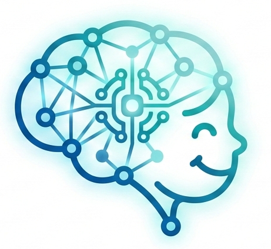

<p align="center">
  
</p>

<h1 align="center">AutiSense-AI</h1>

<p align="center">
  <strong>AI-Enabled Autism Screening Platform</strong><br/>
  Real-time behavioral analysis · ML risk prediction · Clinical-grade reports
</p>

<p align="center">
  
  
  
  
  
  
</p>

---

## 🏗️ Architecture

```
┌─────────────────┐     ┌─────────────────┐     ┌─────────────────┐
│   React + Vite  │────▶│  Express.js API  │────▶│  FastAPI + ML   │
│   (frontend/)   │     │   (backend/)     │     │  (ml-service/)  │
│                 │     │                  │     │                 │
│  • Camera UI    │     │  • Auth (JWT)    │     │  • scikit-learn │
│  • Dashboards   │     │  • REST API      │     │  • MediaPipe    │
│  • Charts       │     │  • MongoDB ODM   │     │  • PDF Reports  │
│  • AI Assistant │     │  • Gateway proxy  │     │  • OpenCV       │
└─────────────────┘     └─────────────────┘     └─────────────────┘
                                │
                        ┌───────┴───────┐
                        │  MongoDB Atlas │
                        └───────────────┘
```

---

## 📂 Project Structure

```
AutiSense-AI/
│
├── .github/workflows/ci.yml       # CI pipeline (lint → build → check)
│
├── frontend/                       # React 19 + Vite + TypeScript
│   ├── src/
│   │   ├── pages/                  # 23 page components
│   │   ├── components/
│   │   │   ├── ui/                 # Design primitives
│   │   │   ├── ai/                 # ML overlay components
│   │   │   ├── camera/             # Camera preview + analysis
│   │   │   ├── charts/             # Behavioral analytics charts
│   │   │   ├── chat/               # AI agent chat
│   │   │   ├── layout/             # Navbar, Footer, AppShell
│   │   │   └── ...                 # auth, effects, story, etc.
│   │   ├── hooks/                  # Custom React hooks
│   │   ├── context/                # Auth, Screening, Theme
│   │   ├── services/               # API clients
│   │   ├── routes/                 # App router
│   │   └── types/                  # TypeScript definitions
│   └── public/                     # Static assets
│
├── backend/                        # Node.js + Express API
│   └── src/
│       ├── server.js               # Express bootstrap (routes, middleware)
│       ├── db.js                   # MongoDB connection + Mongoose models
│       ├── ml.js                   # JS-based ML scoring fallback
│       ├── config/                 # Environment configuration
│       ├── gateway/                # Proxy to Python ML & AI Engine
│       └── data/                   # ML dataset loader
│
├── ml-service/                     # Python FastAPI + ML Models
│   ├── app/
│   │   ├── main.py                 # FastAPI entry point
│   │   ├── ml_analyzer.py          # ML analysis logic
│   │   └── pdf_generator.py        # PDF report generation
│   ├── ai-engine/                  # Computer vision modules
│   │   ├── behavior_analysis.py
│   │   ├── emotion_detection.py
│   │   └── camera_stream.py
│   ├── models/                     # Trained .pkl artifacts (gitignored)
│   └── train_model.py              # Model training script
│
├── docs/                           # Reference documentation
├── docker-compose.yml              # Local MongoDB
├── .editorconfig                   # Consistent formatting
├── .env.example                    # All env vars documented
└── package.json                    # Root scripts (concurrently)
```

---

## 🚀 Quick Start

### Prerequisites

- **Node.js** ≥ 18 &nbsp;|&nbsp; **Python** ≥ 3.10 &nbsp;|&nbsp; **MongoDB Atlas** account (or local via Docker)

### 1. Clone & Install

```bash
git clone https://github.com/amank9115/AutiSense-AI.git
cd AutiSense-AI

# Install all dependencies
npm run install:all
```

### 2. Configure Environment

```bash
# Copy the reference env file and fill in your values
cp .env.example backend/.env
cp .env.example frontend/.env
```

Edit `backend/.env` with your MongoDB Atlas URI and optional API keys.

### 3. Start All Services

```bash
npm run dev
```

This starts all three services concurrently:

| Service       | URL                        | Color   |
|---------------|----------------------------|---------|
| **Frontend**  | http://localhost:5173       | 🟦 Cyan    |
| **Backend**   | http://localhost:4000       | 🟩 Green   |
| **ML Service**| http://localhost:8001       | 🟪 Magenta |

Or start individually:

```bash
npm run dev:frontend    # React dev server
npm run dev:backend     # Express API
npm run dev:ml          # FastAPI ML service
```

---

## 🤖 AI & ML Features

| Feature | Technology | Description |
|---------|-----------|-------------|
| **Live Camera Screening** | MediaPipe + OpenCV | Real-time behavioral analysis |
| **Risk Prediction** | scikit-learn | ASD risk scoring on AQ-10 scale |
| **Emotion Detection** | Computer Vision | Facial expression analysis |
| **AI Assistant** | Gemini API | Contextual guidance for parents |
| **PDF Reports** | ReportLab | Clinical-grade screening reports |

---

## 📡 API Endpoints

### Authentication
| Method | Endpoint | Description |
|--------|----------|-------------|
| POST | `/api/v1/auth/login` | Email/password login |
| POST | `/api/v1/auth/register` | New user registration |
| POST | `/api/v1/auth/google` | Google OAuth login |

### ML Screening
| Method | Endpoint | Description |
|--------|----------|-------------|
| POST | `/api/v1/ml/camera-screening` | Analyze camera frames |
| POST | `/api/v1/ml/live-inference` | Real-time per-frame scoring |
| GET | `/api/v1/ml/sessions/:id` | Get session results |
| GET | `/api/v1/ml/sessions/:id/report` | Download PDF report |

### Analytics
| Method | Endpoint | Description |
|--------|----------|-------------|
| GET | `/api/v1/analysis/live-behavior` | Behavioral timeline |
| GET | `/api/v1/analysis/emotion-timeline` | Emotion tracking |
| GET | `/api/v1/analysis/weekly-progress` | Weekly progress data |

---

## 👥 Multi-Role System

| Role | Capabilities |
|------|-------------|
| **Parent** | Child screening, progress monitoring, development insights |
| **Clinician** | Behavioral analysis tools, case monitoring, session reports |
| **Doctor** | Clinical dashboards, longitudinal tracking, diagnostic insights |

---

## 🔮 Future Roadmap

- [ ] Speech analysis integration
- [ ] AI-powered therapy recommendations
- [ ] Mobile application (React Native)
- [ ] Deep learning behavior models
- [ ] Telemedicine integration

---

## 🤝 Contributors

| Contributor | Role |
|-------------|------|
| **Aman Kumar** | Full-Stack Developer & ML Engineer |
| Team Members | Contributing developers |

---

## 📜 License

This project is developed for **educational and research purposes**. Not intended for clinical diagnosis.

> ⚠️ **Disclaimer**: This platform provides screening support only. It does not provide medical diagnoses. Always consult a licensed healthcare professional for clinical evaluations.
